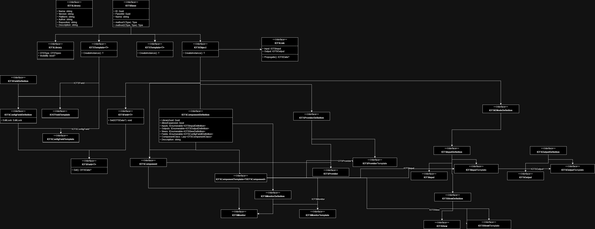

# 127Net
A modular set of tools for creating a smart home network on the cheap. Programming experience not included.


## Features
* Develop device applications graphically
* Create custom components with an easy to use, yet highly customizeable SDK to suit your needs
* Runs on Windows, Linux, and Android. Embedded version coming <sup>eventually.</sup>
* Create personal networks between devices; monitor and control from a distance.
* No need for a central server; create your network as you want!

<br/>
<br/>
<br/>
<br/>
<br/>
<br/>


## Roadmap
| Group | Desc. | Started | Development | Release | Active | Notes |
| ----- | ----- | ------- | ----------- | ------- | ------ | ----- |
| Plugins | Device Info | Yes | Yes | No | -- | |
| Plugins | Basic Math | Yes | Yes | No | -- | |
| Plugins | Basic Logic | Yes | Yes | No | -- | |
| Plugins | Basic Monitors | Yes | Yes | No | -- | |
| Plugins | Basic Providers | Yes | Yes | No | -- | |
| Editor | Core setup | Yes | Yes | No | Yes | |
| Editor | Custom Settings | No | No | No | No | |
| Editor | Signal Simulation | No | No | No | No | |
| Network | Cross Device | No | No | No | No | |
| Network | Transient Access | No | No | No | No | |
| Network | Peer Streaming | No | No | No | No | |
| Network | Device Control | No | No | No | No | |
| Network | App blueprint sharing | No | No | No | No | |
| Network | Plugin Sharing | No | No | No | No | Security restrictions required, may be removed. |
| Library | Preview loaded plugins | No | Yes | No | No | |
| Library | Reload plugins | No | No | No | No | |

<br/>
<br/>
<br/>
<br/>

## Application Development

### Components

    Components are instances of templates designed to perform a specific task. These component templates are designed with the OTS SDK for the target platform, and distributed as plugins. These plugins are compiled and loaded as dynamic libraries. Immediately available plugins are available as part of the standard OTS plugin set.
    
    Components are comprised of four external characteristics: Inputs, Views, Outputs, and Fields. 
    
    Inputs and Views
     
    Inputs and Views are similar in that they allow components to receive information to process. However, while Inputs are static; they have a fixed number and always pass information to the same internal structures, Views are dynamically created. When a component enables Views, any number of input Views may be created by linking an output to an unused View node. A new unused View node is then created. View nodes are destroyed upon unlinking. If Views are enabled, there will always be a single unused View node visible in the editor.
    
    Outputs
    
    Outputs allow the transfer of Component results. There is no View equivalent for Outputs. 

    Fields
    
    Fields search two purposes depending on their configuration. They may act as additional inputs for constant values, such as to set a configuration for a component. Or, if readonly as is on a Monitor, as a display for attached View values. In which case, these View associated Fields will populate along with each connected View. 

### Component Types
    Components are currently divided into five categories: while all are components and contain some similar functionality, different classes of component are optimized for specific tasks. In particular, these are classified by their inputs and outputs.

| Class | Has Inputs | Allows Views | Has Outputs |
| ----- | ---------- | ------------ | ----------- |
| Actuator | &check; | &check; | &check; |
| Provider | x | x | &check; |
| Monitor | &check; | &check; | x |
| Single | x | x | x |
| Nomad | x | &check; | &check; |

<br/>
<br/>
<br/>
<br/>

### Component Architecture


### Custom Components (C#)
> This section will briefly outline creation of custom plugins in C#. 
```
//Template
public class CustomTemplate(string name, Guid libGuid, string description) : 
    OTSComponentTemplate<IOTSComponent>(name, libGuid, description,
    [],//Input List
    [],//Output List
    [],//Fields List
    ,false//Allow Views
    )
{
    public override IOTSComponent CreateInstance(){
        return new CustomComponent(this);
    }
}

//Base Component - useful for common components in library
public abstract class OTSCustomBase(OTSCustomTemplate template): OTSComponent(template){
    //Common members
}

//Custom Component
public class OTSCustomComponent : OTSCustomBase{
    //Fields
    public OTSCustomComponent(OTSCustomTemplate template) : base(template){
        //setup
    }

    public override void Update(){
        //Code to update every system cycle
    }
}

//Library
public class CustomLibrary : IOTSLibrary{
    string Name { get; } = "Library Name";
    string Version { get; } = "Version String";
    string Platform { get; } = CommonUtil.GetOsStr;
    string Author { get; } = "Your name here";
    string Repository { get; } = "Link to repository";
    string Description { get; } = "Library Description";
    Guid ID { get; } = Guid.NewGuid();
    IEnumerable<IOTSComponentTemplate<IOTSComponent>> Components { get; }
    public IOTSComponent? GetComponent(string name)
        => Components.FirstOrDefault(x => name.Equals(x.Name, StringComparison.OrdinalIgnoreCase))?.CreateInstance();

    public CustomLibrary(){
        
        var customComponent = new CustomComponent("Component Name", ID, "Component description");
        
        Components = [
            customComponent
        ]
    }
}

```

### Custom Components (Android (Kotlin))
> TODO

### Custom Components (C++)
> TODO

<br/>
<br/>
<br/>
<br/>

## Application Editor


<br/>
<br/>
<br/>
<br/>

## Device Network 


